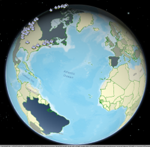

# SAS ArcGISWebMapProvider  



For an overview of this project from the perspective of a user, see the document "[Using ArcGIS WebMaps in SAS Visual Analytics](https://raw.githubusercontent.com/sassoftware/sas-visualanalytics-geowebmap/master/doc/UsingArcGISWebMapsInSASVA.pdf)."  

## Project

This project presents a web page with an ArcGIS map designed to serve as a data-driven content for reports built with SAS Visual Analytics. The majority of the code is a fork of [jsapi-resources](https://github.com/Esri/jsapi-resources), Esri's template for JS apps. Uses DOJO and ArcGIS for JS 4.6.

A "copy:debug" task has been added to the normal build which will copy an `ArcGISVisualizationBridgeCDN.html` file into the "dist" directory.  This file accomplishes the main tasks that the built application will do, without requiring a full build; however, it may not be as performant as the main application (served by index.html).  *(This file is composited manually, and it is not always up-to-date with the latest changes.)*

The task also adds an `.htaccess` file, which, if configured, will allow an Apache server to cache the built project
for a minute.

* `npm run buildDebug` - runs the build, leaving the uncompressed js in the `dist` directory.

**Normal installation follows these steps:**

* Download the project.
* Open a command-line context at the project directory.
* `npm install`
* `npm run build`
* Copy the built application from the `dist` directory to your web server's directory.

## Application

### Overview

From SAS Visual Analytics, users can add a "Data-Driven Content" object to their report and set its "Web Content" url to the deployment directory.  They can then use the supported query string arguments to customize the type and styling of the visualization layer in which the report data appears above the ArcGIS map.

Data-driven content aggregates report data.  Keep this in mind when including location coordinate information, which is required for scatter and bubble plots.  The default aggregation method for numeric columns is "sum", and summing coordinates (e.g, latitude and longitude) will produce values that cannot be geographically located.  For these coordinate columns, either switch their aggregation type to something less disruptive (such as "average"), or take other steps to ensure that there is only one category value per location, so that no aggregation of their coordinates will occur.  For instance, VA's "Geographic Items," when set to the data type "custom coordinates," protect against inappropriate aggregation, and their use is preferred.

### Query string arguments

| Argument | Description |
| --- | --- |
| visualizationType | Optional.  Possible values include "scatter", "bubble", or "choropleth".  If unspecified, the value will be inferred from other arguments or left as "scatter". |
| x | The label of the column containing longitude expressed in the same terms as the base map.  Defaults to "Longitude".  Required for scatter and bubble visualizations. |
| y | The label of the column containing latitude expressed in the same terms as the base map.  Defaults to "Latitude".   Required for scatter and bubble visualizations. |
| size | The label of the column containing the size measurement.  Required for bubble visualizations. |
| color | The label of the column containing the color measurement.  Optional for bubble and choropleth visualizations. |
| animation | The label of the column containing the date used when animating through the data.  Optional.  Animations are not currently supported in choropleths or 3D views, and they should be considered experimental.  It has been observed that performance degrades rapidly when the data's row count enters the tens of thousands.  Acceptable date formats are those correctly interpreted by [Moment](http://momentjs.com/), which include RFC2822 and ISO formats. |
| colorMin | A hex, rgba, or named color for the minimum value of the range.  Defaults to "#bfe4e7" (also expressed, for example, as "rgba(191,228,231,1)", which is somewhat close to "LightCyan"). |
| colorMax | A hex, rgba, or named color for the minimum value of the range.  Defaults to "#00929f".  Also controls dot color for the scatter plot as well as default color for the choropleth (when no color column is assigned). |
| outline | A hex, rgba, or named color for an outline on drawn shapes.  Defaults to "#007E88".  Also controls highlight color for 3D views. |
| geoId | The label of the column containing the geographic identifiers for the areas to be drawn.  Required for choropleth. |
| featureServiceUrl | The url to the Esri feature service containing the shapes of the geographies identified by the geoId.  Required for choropleth. |
| featureServiceGeoId | The name of the attribute in the Esri feature service that will match values found in the geoId column of the VA data.  Required for choropleth. |
| featureServiceWhere | A where clause to be provided to the Esri feature service that filters results.  Optional. |
| featureServiceMaxAllowableOffset | The optional maxAllowableOffset provided to the feature service.  Can be used to restrict the amount of detail (and thus transmission size) of the geographic shapes it returns. |
| portalItemId | The ID for a web map served at arcgis.com.  Optional.  Defaults to basemap "osm" (OpenStreetMap). |
| baseMap | The ID for a basemap from arcgis.com (e.g., "streets", "satellite", "hybrid").  Optional.  Defaults to basemap "osm" (OpenStreetMap).  Ignored if portalItemId is set. |
| use3D | Set to "true" to display the map in a 3D SceneView.  Defaults to false. |
| title | The title of the layer that includes VA data.  Optional.  Defaults to the geoId, if available, or to "SAS VA Layer", if not. |
| zIndex | The index of the layer that includes VA data.  Optional.  Use "0" to insert the layer below all others.  Defaults to the top-most level. |
| period | Defines the interval used to subdivide the animation date.  Valid values are units of time accepted by [Moment](http://momentjs.com/) (e.g., "millisecond", "day", "month", "year").  Defaults to "year". |
| useSmartLegends | Set to "true" to use Esri's "smart mapping" legends for color and size (where appropriate).  Defaults to false.  This feature is experimental. |
| useSampleData | Set to "true" to load data from SampleData.json instead of VA.  Useful for testing.  Optional. |

### Example URLs (using sample data)

A simple scatter plot layer:

http://&lt;server&gt;/ArcGisWebMapProvider/?visualizationType=scatter&useSampleData=true

A simple bubble plot layer:

http://&lt;server&gt;/ArcGisWebMapProvider/?visualizationType=bubble&x=Longitude&y=Latitude&color=Life%20expectancy%20at%20birth,%20total%20(years)&size=GDP%20(current%20US$)&useSampleData=true

A choropleth drawing countries and joining on "NAME":

http://&lt;server&gt;/ArcGisWebMapProvider/?visualizationType=choropleth&geoId=Geographic%20Item%201&color=GDP%20(current%20US$)&featureServiceUrl=https://services.arcgis.com/V6ZHFr6zdgNZuVG0/ArcGIS/rest/services/World_borders/FeatureServer&featureServiceGeoId=NAME&useSampleData=true

An "animated" scatter plot:

http://&lt;server&gt;/ArcGisWebMapProvider/?useSampleData=true&animation=Date

### Some useful Esri feature layers

* [World borders](https://services.arcgis.com/V6ZHFr6zdgNZuVG0/ArcGIS/rest/services/World_borders/FeatureServer)
* [US states](https://services.arcgis.com/V6ZHFr6zdgNZuVG0/ArcGIS/rest/services/Cartographic_Boundary_Files_-_States_%28500k%29/FeatureServer)

## Data-driven visualizations

Information about using data-driven visualizations in SAS Visual Analytics is found both at the repository supporting general [third-party visualizations](https://github.com/sassoftware/sas-visualanalytics-thirdpartyvisualizations/blob/master/README.md) and at the post [Programming Considerations for Data-Driven Visualizations](http://go.documentation.sas.com/?cdcId=vacdc&cdcVersion=8.2&docsetId=varef&docsetTarget=n109mqtyl6quiun1mwfgtcn2s68b.htm).

At a high level, data-driven visualizations are HTML pages listening to the window's "message" event for data having a format similar to the following:

```
{
    data: {
        columns: [
            {name: "carColumnName", label: "car", type: "string"},
            {name: "priceColumnName", label: "price", type: "number"}
        ],
        data: [
            ["Ford", 1000],
            ["Toyota", 2000],
            ["BMW", 1500]
        ],
        resultName: "sasVAResultName",
        rowCount: 3
    }
}
```

See [SampleData.json](src/sas/ArcGISWebMapProvider/SampleData.json) for a more complete example.

## Further information

Use of Esri's ArcGIS SDK is subject to their [licensing requirements](https://developers.arcgis.com/arcgis-runtime/licensing).

Subsequent notes are from Esri's (dojo-based) [build project](https://github.com/Esri/jsapi-resources).

# Bower Sample application

This is a sample application showing how to use [Bower](http://bower.io/) to build your [ArcGIS API for JavaScript](https://developers.arcgis.com/javascript/) application.
It provides a Gruntfile for build scenario using Dojo.

# Requirements
* [node & npm](https://nodejs.org/)
* [bower](http://bower.io/)
* [java 7 or greater](https://java.com/en/download/) - for [Closure Compiler](https://github.com/google/closure-compiler) used during build

# Usage
* `npm install -g bower` - installs bower
* `npm install` - installs required node and bower packages
* `npm run clean` - removes built files from `dist` directory
* `npm run build` - run the Dojo build on application

If you are interested in building the [Sass](http://sass-lang.com/) files included in the Bower release of the API, please refer to this [document](SASS.md).

## Additional tools
We have also included a `gulpfile` if that is your build tool of choice. Just run `gulp` to start the build.

And just to demonstrate that it can be done, we've included a `makefile` so you can build the demo application using the `make` command.

If you have [Python](https://www.python.org/) you can run `python -m SimpleHTTPServer` in same folder as application to run it in a browser.

# Notes
For details on the Dojo build system, [review the Dojo documentation](http://dojotoolkit.org/documentation/tutorials/1.10/build/index.html).
